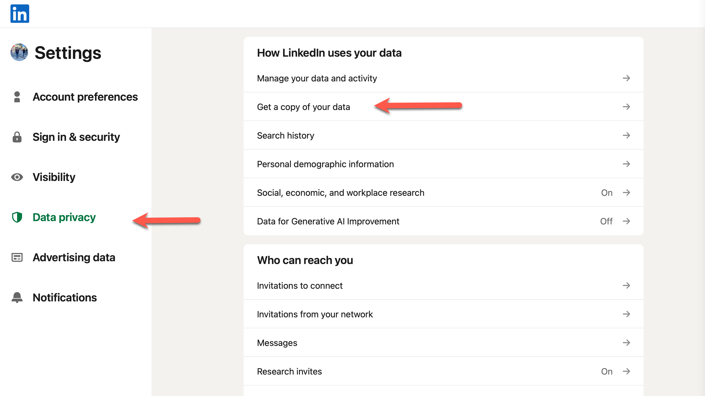
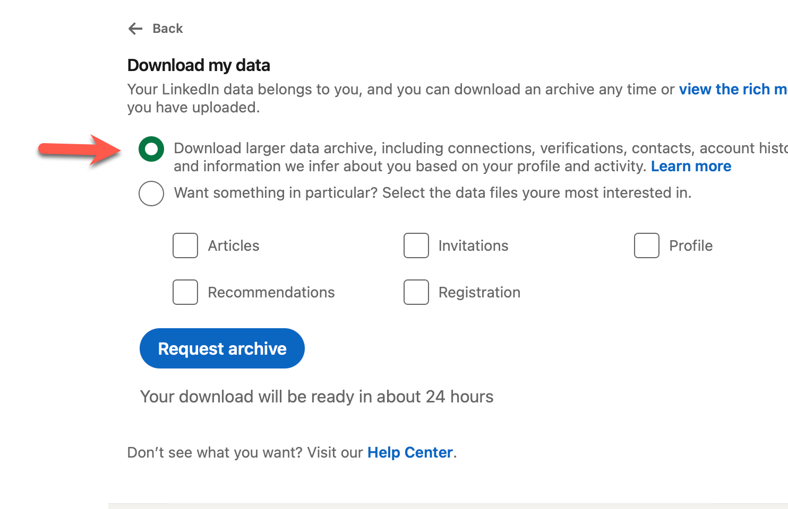
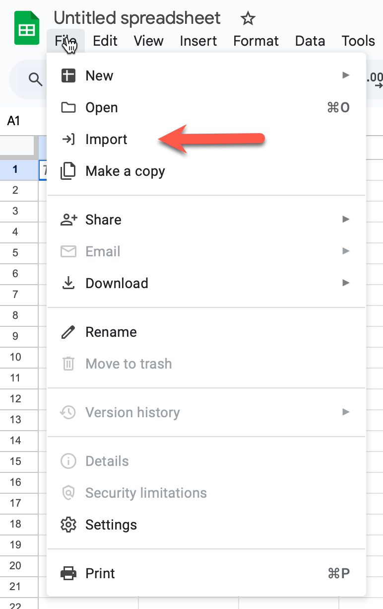
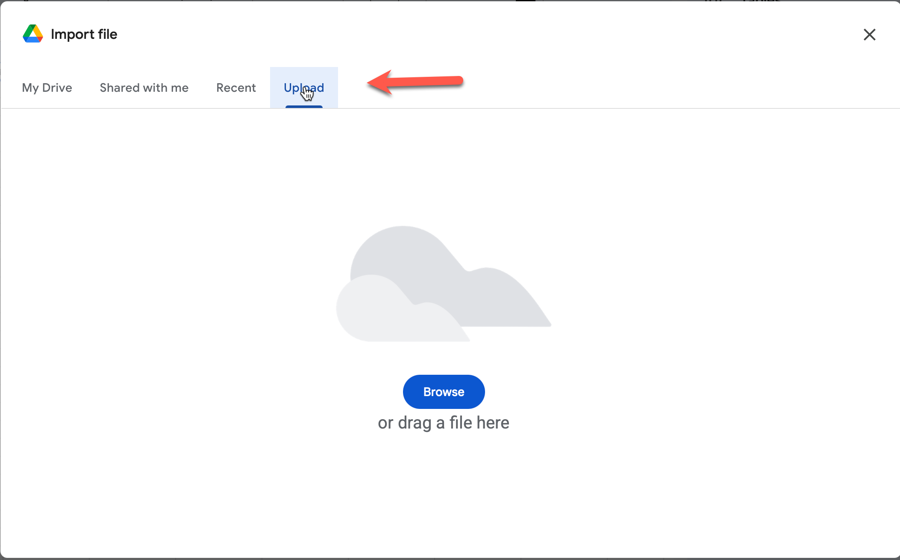

# List the companies in your network

When I started my job hunt, I was relying on my memory of who worked where and who may have open positions.

Yeah, don't do that.

People left your workplace after you and possibly changed jobs multiple times.  Most people won't consistently update LinkedIn if they're not looking for work.  They usually update LinkedIn when they start at a new company.

That means if you have a LinkedIn profile, you likely have all you need.

To get the list of companies that employ people in your network:

1. Go to [LinkedIn](https://www.linkedin.com/) and click on your profile.

2. Select "Settings and Privacy"


3. Select "Data Privacy"

4. Select "Get a copy of your data"

 Get a copy of your data" />

5. Request a new archive of your data if you have not before.

6. Request everything

 Download larger data archive..." />

The file that we are after is `Connections.csv`.  As far as I can tell, it only exists in the large data set.  Given the delays in requesting LinkedIn data, I haven't been able to go through all of the options, but I know the file is there in this one.

7. Wait for your email

They say it can take up to 24 hours, but in my experience I have the file inside of an hour or two.

8. Unpack the archive and put the `Connections.csv` file in a convenient place.

9. Get the unique companies in your network.

You can do this on the terminal with:

```
cat Connections.csv | cut -f 5 -d "," | sort | uniq
```

Or, if you don't have the Unix text processing tools, you can do this in Google Sheets.

9a. Create a new Google Sheet.

9b. Select "File" -> "Import"

 File -> Import" />

9c. Select "Upload a new file" and upload your `Connections.csv`.

You can use the "Replace sheet" option when prompted.

 Upload a new File" />

9d. Find an empty column and enter the formula

```
sort(unique(E2:2999))
```

This will produce an alphabetized list of companies that people in your network work for.  The alphabetizing isn't strictly necessary, but I find it easier to navigate.

And there you have it.  Now you are ready to [see which companies in your network have open postings.](../jobs-page/README.md)